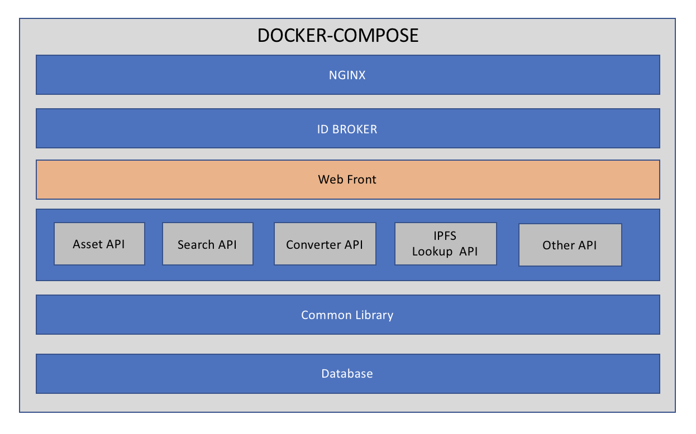
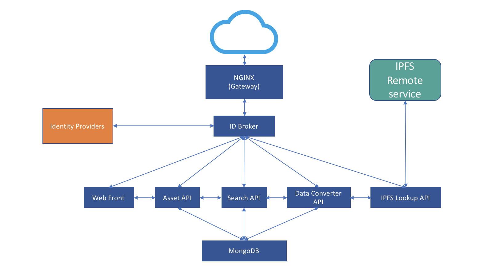

# RAIDAR (OpenMusic)

RAIDAR (Open Music http://openmusic.mit.edu) is a joint project between MIT and Berklee to explore new technologies and infrastuctures for the digital music supply-chain.

## Design concept
It has been designed with microservices (https://en.wikipedia.org/wiki/Microservices) architecture. 
Each microservice runs in docker container using docker-compose.

# Microservices

* **1) Web Form microservice**
	* This is the web front of the RAIDAR.
	* It runs in docker container
	* It is based on Angular v1.6.1.
	
* **2) Asset API microservice**
	* This is a RESTful service for providing Asset json/xml data
	* It runs in docker container
	* It is spring-boot application
	
* **3) MongoDB microservice**
	* This is the backend mongo database.
	* It runs as a docker cotainer
	
* **4) Converter API microservice**
	* This is the data converter service.
    * It is a RESTful API
	* It supports following convertion:
		* MARC to RAIDAR json
		* RAIDAR to MARC json/xml
		* DDEX to RAIDAR json
		* RAIDAR to DDEX json/xml
	* This also supports batch data conversion processing.	
		
* **5) Search API (Solr) microservice**
	* This is the search microservice. Currently, Apache Solr will be used as a serch provider.
    * It is a RESTful API 
	* Since this is a microservice based architecture, in the future, Elastic Search ELK stack can be used for better search, logging and visualization.

* **6) Content-lookup/fetch API microservice**
	* This is very simple microservice that supports lookup, fetch and call out to IPFS service.
    * It is a RESTful API

* **7) Identity Broker microservice**
	* This is a microservice, which will sit in between Identity Providers (Barklee, Google, FaceBook, etc.) and RAIDAR Web front.
	* User will be able to choose thier Identity Provider.
	* It will provide a short lived token or API Key for accessing microservices.

* **8) NGINX** 
	* This the reverse proxy, which is the gateway for all microservices.
	* This service is for routing external calls to the correct service (e.g. port number, IP, etc)

# RAIDAR Stack

# RAIDAR High Level Architecture

## Initial Author

* **Mizanul Hoq Chowdhury** - *Architecture, Design, Initial work* - 

